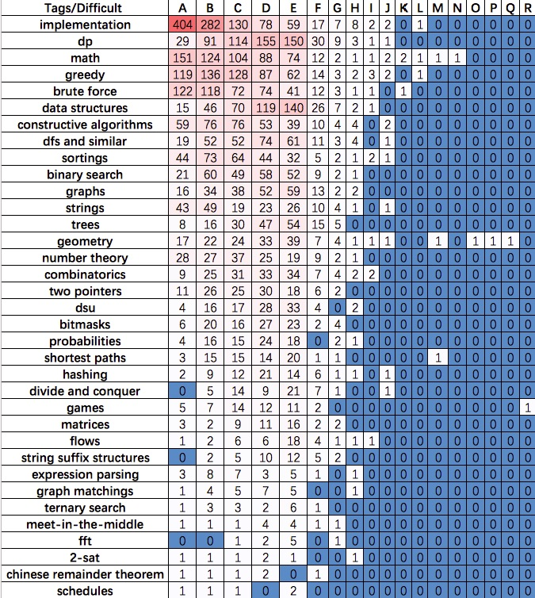

# Puzzle-Type

Collected from solved problem in Codeforces.

Difficulty:

* 1000 or below: easy
* 1100-1500: medium
* 1600-1900: hard
* 2000 or higher: almost not appear in leetcode (interview or written examination)

Type distribution and accepted distribution:

## Implement

Easiest type, only appear in A or B. Not list here.

## Math

Combine with almost all problems, easy mathematic calculation.

* 1499C

## Number-theory

* 1499D

## Greedy

* 1499B / 1499C

## DP

* 1499D
